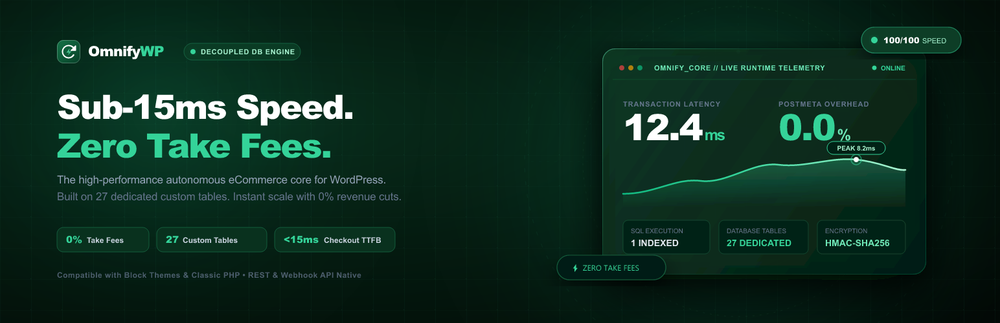

<p align="center">
  
</p>

# ⚡ OmnifyWP eCommerce

<p align="center">
  <strong>Fast, Lightweight, and Conversion-Optimized eCommerce Engine for WordPress.</strong><br>
  Sell digital downloads, software, physical products, and multi-format variations with built-in global payment gateways and zero transaction fees.
</p>

<p align="center">
  <a href="https://wordpress.org"></a>
  <a href="https://php.net"></a>
  <a href="https://gnu.org/licenses/gpl.html"></a>
  <a href="https://omnifywp.com/doc/"></a>
  <a href="https://playground.wordpress.net/?blueprint-url=https%3A%2F%2Fraw.githubusercontent.com%2Fomnifywp%2Fomnifywp-ecommerce%2Fmain%2Fblueprint.json"></a>
  <a href="#-developer-extensibility"></a>
</p>

---

## 🚀 Quick Links & Live Preview

* 🎮 **Interactive Live Demo (Browser Playground):** [Launch OmnifyWP Demo →](https://playground.wordpress.net/?blueprint-url=https%3A%2F%2Fraw.githubusercontent.com%2Fomnifywp%2Fomnifywp-ecommerce%2Fmain%2Fblueprint.json) *(Full store & admin preview, zero installation required)*
* 📘 **User Documentation & Merchant Guide:** [`docs/USER_DOCUMENTATION.md`](docs/USER_DOCUMENTATION.md) | [Interactive User Guide](docs/user-guide.html)
* 📖 **Developer Documentation & REST API:** [`docs/DEVELOPER_DOCS.md`](docs/DEVELOPER_DOCS.md) | [https://omnifywp.com/doc/](https://omnifywp.com/doc/)
* 💻 **Official Website:** [https://omnifywp.com](https://omnifywp.com)

---

## ✨ Why OmnifyWP?

* 🏎️ **Sub-100ms Performance**: Purpose-engineered relational tables (`wp_omnify_*`) eliminate `wp_postmeta` overhead, guaranteeing instant storefront and checkout response times.
* 💸 **0% Platform Fees**: Keep 100% of your store revenue. No arbitrary platform commissions or forced monthly subscriptions.
* 🌍 **Global & Regional Payment Methods**: 10+ payment methods pre-integrated out of the box with zero third-party plugin bloat.
* 🔐 **Cryptographically Protected Downloads**: Time-limited SHA-256 HMAC digital tokens prevent asset piracy and unauthorized file hotlinking.
* 🎨 **Clean, Native Admin Experience**: Built with modern, streamlined UI patterns that integrate seamlessly into the WordPress admin dashboard.

---

## 🌟 Core Features

### 🛍️ Storefront & Conversion Architecture
* **Responsive Storefront Catalog Grid**: High-end storefront layout with instant filter drawers, search, category pills, and responsive layout toggles.
* **1-Click AJAX Quick Add**: Add products directly to cart without page reloads, accompanied by instant micro-animations and live badge counts.
* **3-Column Product Details**: Media gallery, feature highlights, trust signals, customer reviews, and a sticky purchase action panel.
* **Variable, Simple & Bundled Products**: Offer format-specific pricing, custom licenses, digital asset files, or multi-item bundles.
* **Customer Wishlist**: Save favorite items to user accounts for increased returning-visitor conversions.
* **Cart Scarcity Countdown & Free Shipping Bar**: Session-persisted countdown timer and free-shipping progress tracker designed to minimize checkout drop-offs.

### 💳 Complete Global Payment Gateways
OmnifyWP includes first-party payment processing integrations with automatic status sync, refunds, and access revocations:
* **Stripe**: Credit/debit cards, Apple Pay, Google Pay, Alipay, and Stripe Checkout.
* **PayPal Commerce**: Express Checkout, smart payment buttons, and card handling.
* **Paystack**: Top payment gateway for Nigeria, Ghana, South Africa, and Kenya.
* **Tap Payments**: Comprehensive card, KNET, Mada, and Benefit payments across GCC/Middle East.
* **Mollie**: Ideal for Europe (iDEAL, Bancontact, SEPA Bank Transfer, SOFORT).
* **Razorpay**: UPI, cards, netbanking, and wallets for Indian commerce.
* **Alipay & WeChat Pay**: Seamless QR code and mobile checkout for East Asian shoppers.
* **Khalti & eSewa**: Trusted digital wallets and mobile banking for Nepal.
* **SSLCommerz**: Dedicated card, internet banking, and mobile wallet flow for Bangladesh.
* **Manual Payment Workflows**: Direct Bank Transfer (BACS), Cheque, Cash on Delivery (COD), and custom manual payment instructions.

### 🔒 Cryptographic Digital Locker
* **HMAC-SHA256 Signed Links**: Generated with user-configurable expiry times, download count limits, and IP audit logging.
* **Chunked Streaming Delivery**: Protected digital files are streamed safely via PHP buffers without revealing actual file paths on the filesystem.
* **Customer Account Dashboard**: Shortcode (`[omnify_customer_downloads]`) provides customers with direct access to file licenses, orders, and address books.
* **Bandwidth & Usage Auditing**: Detailed tracking of downloads, IP logs, and server throughput.

### 📊 Modern Management & CRM Tools
* **Unified Admin Panel**: Standardized management tables across Products, Orders, Customers, Coupons, Abandoned Carts, and Reviews.
* **Trash & Soft Delete**: Full safety net allowing restoring or permanent purging of deleted store records.
* **Coupons & Discount Rules**: Percentage, fixed, minimum cart subtotals, and expiration configurations.
* **Review Moderation System**: Dedicated workflow to approve, edit, filter, or trash user reviews and star ratings.
* **Abandoned Cart Recovery**: Automatic recording of abandoned sessions with manual checkout recovery email dispatches.
* **Customer Activity CRM**: Timeline tracking customer actions such as checkout initiation, completed orders, and support notes.

---

## 📡 REST API Reference

OmnifyWP provides a fully functional REST API under `/wp-json/omnify/v1` for headless frontends, mobile apps, and custom webhooks.

### Public Storefront Endpoints
| Route | Method | Description |
| :--- | :---: | :--- |
| `/status` | `GET` | Retrieve store status and database migration health. |
| `/products/public` | `GET` | Query catalog products with filters, sorting, and pagination. |
| `/products/public/slug/{slug}` | `GET` | Retrieve product details by slug. |
| `/cart` | `GET` \| `POST` \| `DELETE` | Read, update, or clear customer cart contents. |
| `/checkout` | `POST` | Process customer checkout payload. |
| `/checkout/validate-coupon` | `POST` | Validate and calculate coupon discounts. |
| `/checkout/payment-methods` | `GET` | Fetch enabled storefront payment gateways. |

### Protected Management Endpoints
| Route | Method | Description |
| :--- | :---: | :--- |
| `/products` | `GET` \| `POST` | Create or list catalog products. |
| `/products/{id}` | `GET` \| `PUT` \| `DELETE` | Read, update, or delete an existing product. |
| `/orders` | `GET` | List store orders with status and date filters. |
| `/orders/{id}` | `GET` | Fetch full order details including line items and customer records. |
| `/customers` | `GET` \| `POST` | List or register customer profiles. |
| `/settings` | `GET` \| `POST` | Retrieve or update store configuration. |

---

## 🔌 Developer Extensibility

OmnifyWP is architected around WordPress hooks and an extensible dependency injection container.

### Core Action & Filter Hooks
```php
// Intercept or customize price formatting
add_filter('omnify_format_price', function($formatted_price, $amount, $settings) {
    return $formatted_price;
}, 10, 3);

// Custom validation rule during checkout
add_filter('omnify_after_checkout_validation', function($error, $data, $settings, $items) {
    if (empty($data['billing_email'])) {
        return new \WP_Error('invalid_email', 'Please enter a valid email address.');
    }
    return $error;
}, 10, 4);

// Hook into settings updates
add_action('omnify_settings_saved', function($section, $posted) {
    // Perform custom cache invalidation or audit logging
}, 10, 2);
```

### Accessing Internal Services
```php
$container = omnify()->container();
$product_repo = $container->get(\Omnify\eCommerce\Repositories\Product_Repository::class);
$featured_products = $product_repo->all(['is_featured' => 1]);
```

---

## 🌐 External Services

OmnifyWP integrates with external third-party payment gateways and services to process orders and transactions. Data is transmitted securely only when the respective service is enabled by the administrator or chosen by the buyer:

* **Stripe** ([Terms](https://stripe.com/legal/consumer) | [Privacy](https://stripe.com/privacy))
* **PayPal Commerce** ([User Agreement](https://www.paypal.com/us/legalhub/useragreement-full) | [Privacy Statement](https://www.paypal.com/us/legalhub/privacy-full))
* **Paystack** ([Terms](https://paystack.com/terms) | [Privacy](https://paystack.com/privacy))
* **Tap Payments** ([Terms & Privacy](https://tap.company/privacy))
* **Mollie** ([Terms & Privacy](https://www.mollie.com/en/privacy))
* **Razorpay** ([Terms](https://razorpay.com/terms/) | [Privacy](https://razorpay.com/privacy/))
* **Alipay** ([Terms](https://render.alipay.com/p/f/agreementpages/alipayterms.html) | [Privacy](https://render.alipay.com/p/f/agreementpages/alipayprivacy.html))
* **WeChat Pay** ([Terms](https://www.wechat.com/en/service_terms.html) | [Privacy](https://www.wechat.com/en/privacy_policy.html))
* **SSLCommerz** ([Terms](https://sslcommerz.com/terms-and-conditions/) | [Privacy](https://sslcommerz.com/privacy-policy/))
* **Gravatar** ([Automattic Privacy](https://automattic.com/privacy/))
* **Google Analytics 4 & Meta Pixel** *(Optional merchant conversion tracking)*

---

## 📄 License

OmnifyWP eCommerce is open-source software licensed under the **GPL-2.0-or-later**.