# 📖 OmnifyWP eCommerce — Complete User Manual & Store Owner Guide

> **Official User Documentation for OmnifyWP eCommerce**  
> **Plugin Version:** 1.2.0 | **WordPress Requirements:** 6.5+ | **PHP Requirements:** 8.2+ | **Database:** MySQL 5.7+ / MariaDB 10.3+  
> **Official Website:** [https://omnifywp.com](https://omnifywp.com) | **wp.org:** [https://wordpress.org/plugins/omnifywp-ecommerce/](https://wordpress.org/plugins/omnifywp-ecommerce/)  
> **Developer Docs:** [`DEVELOPER_DOCS.md`](./DEVELOPER_DOCS.md) | **HTML Guide:** [`user-guide.html`](./user-guide.html)

---

## Table of Contents
1. [Introduction to OmnifyWP eCommerce](#1-introduction-to-omnifywp-ecommerce)
2. [Installation, Activation & Onboarding](#2-installation-activation--onboarding)
   - [System Prerequisites](#system-prerequisites)
   - [Step-by-Step Installation](#step-by-step-installation)
   - [Onboarding Setup Wizard](#onboarding-setup-wizard)
   - [Core Generated Store Pages](#core-generated-store-pages)
3. [Store Dashboard & Performance Overview](#3-store-dashboard--performance-overview)
   - [Key Performance Indicators (KPIs)](#key-performance-indicators-kpis)
   - [Store at a Glance & Quick Actions](#store-at-a-glance--quick-actions)
   - [Recent Orders & Customer Feeds](#recent-orders--customer-feeds)
4. [Product Catalog & Inventory Management](#4-product-catalog--inventory-management)
   - [Products Directory & Filters](#products-directory--filters)
   - [Adding & Editing Products](#adding--editing-products)
   - [Supported Product Types (Physical, Variable, Digital, Bundle)](#supported-product-types)
   - [Pricing, Sales Scheduling & Inventory Rules](#pricing-sales-scheduling--inventory-rules)
   - [Product Taxonomies: Categories, Tags, Brands & Attributes](#product-taxonomies)
5. [Order Lifecycle, Fulfillment & Refunds](#5-order-lifecycle-fulfillment--refunds)
   - [Orders Listing & Status Workflows](#orders-listing--status-workflows)
   - [Order Details & Financial Breakdown](#order-details--financial-breakdown)
   - [Fraud & Risk Assessment Engine](#fraud--risk-assessment-engine)
   - [Processing Refunds & Automatic License Revocation](#processing-refunds--automatic-license-revocation)
   - [Order Notes & Customer Receipts](#order-notes--customer-receipts)
6. [Customer Relationship Management (CRM)](#6-customer-relationship-management-crm)
   - [Customer Directory & Lifetime Analytics](#customer-directory--lifetime-analytics)
   - [Customer Address Books & Access Control](#customer-address-books--access-control)
7. [Promotions, Discounts & Coupons Engine](#7-promotions-discounts--coupons-engine)
   - [Creating Promotional Coupons](#creating-promotional-coupons)
   - [Discount Rules, Restrictions & Usage Limits](#discount-rules-restrictions--usage-limits)
8. [Store Analytics & Business Intelligence](#8-store-analytics--business-intelligence)
   - [Sales Over Time & Performance Cards](#sales-over-time--performance-cards)
   - [Conversion Rates, AOV & Metric Comparisons](#conversion-rates-aov--metric-comparisons)
   - [Exporting Reports to CSV](#exporting-reports-to-csv)
9. [Customer Reviews Moderation](#9-customer-reviews-moderation)
   - [Review Directory & Ratings Management](#review-directory--ratings-management)
   - [Review Approvals, Spam Handling & Trashing](#review-approvals-spam-handling--trashing)
10. [Abandoned Cart Recovery](#10-abandoned-cart-recovery)
    - [Automated Cart Tracking](#automated-cart-tracking)
    - [Recovery Notification Workflows & Conversion Stats](#recovery-notification-workflows--conversion-stats)
11. [Store Configuration & Settings](#11-store-configuration--settings)
    - [General Settings (Currency, Locales, Formatting)](#general-settings)
    - [Payment Gateways Configuration (Stripe, PayPal, Razorpay, SSLCommerz, COD, Bank Transfer)](#payment-gateways-configuration)
    - [Shipping & Delivery Zones](#shipping--delivery-zones)
    - [Tax Calculation & Regional Rates](#tax-calculation--regional-rates)
    - [Customer Email Notifications & Templates](#customer-email-notifications--templates)
    - [Checkout Flow Configuration](#checkout-flow-configuration)
    - [Store Pages Mapping](#store-pages-mapping)
12. [System Tools, Demo Seeding & Maintenance](#12-system-tools-demo-seeding--maintenance)
    - [One-Click Demo Data Generation & Reset](#one-click-demo-data-generation--reset)
    - [Database Integrity Check & Cache Flushing](#database-integrity-check--cache-flushing)
13. [Administrative Activity Audit Log](#13-administrative-activity-audit-log)
14. [REST API Access & Integrations](#14-rest-api-access--integrations)
15. [Customer Storefront Experience](#15-customer-storefront-experience)
    - [Storefront Catalog & Grid Filters](#storefront-catalog--grid-filters)
    - [Single Product Page (Gallery, Swatches, Urgency, Reviews)](#single-product-page)
    - [Interactive Shopping Cart](#interactive-shopping-cart)
    - [Frictionless Multi-Step Checkout](#frictionless-multi-step-checkout)
    - [Customer Account Portal & Order Tracking](#customer-account-portal--order-tracking)
    - [Cryptographic Digital Downloads Delivery](#cryptographic-digital-downloads-delivery)
16. [Frequently Asked Questions & Troubleshooting](#16-frequently-asked-questions--troubleshooting)

---

## 1. Introduction to OmnifyWP eCommerce

**OmnifyWP eCommerce** is a high-performance eCommerce solution engineered from the ground up for modern WordPress store owners, digital entrepreneurs, creators, and merchants.

### Why OmnifyWP eCommerce?
Traditional WordPress eCommerce plugins rely heavily on the WordPress core `wp_posts` and `wp_postmeta` tables. As your store grows to thousands of orders and products, querying EAV (Entity-Attribute-Value) postmeta creates massive database overhead, slow page loads, and checkout bottlenecks.

OmnifyWP solves this with:
* **Custom Normalized SQL Tables**: 18 dedicated tables specifically indexed for products, variations, orders, customers, downloads, reviews, and logs.
* **Instantaneous Page Loads**: Sub-millisecond database queries regardless of store size.
* **All-in-One Product Support**: Sell physical goods, variable multi-attribute items, software, audio/video courses, digital downloads, and product bundles simultaneously.
* **Enterprise Digital Locker**: Built-in HMAC-SHA256 cryptographically signed download tokens, 8KB chunked memory-safe file delivery, and automated access revocation upon refunds.
* **Zero-Friction Checkout**: Sleek single-page and multi-step checkout layouts designed to maximize conversion rates.

---

## 2. Installation, Activation & Onboarding

### System Prerequisites
Ensure your hosting environment meets the following specifications before installing OmnifyWP eCommerce:
* **WordPress:** 6.5 or higher
* **PHP:** 8.2 or higher (with `mbstring`, `openssl`, `curl`, and `json` extensions enabled)
* **Database:** MySQL 5.7+ or MariaDB 10.3+
* **HTTPS/SSL:** Required for production Stripe, PayPal, and digital download token security.

### Step-by-Step Installation
1. Download the plugin archive `omnifywp-ecommerce.zip` from your account portal or repository.
2. In your WordPress dashboard, navigate to **Plugins → Add New → Upload Plugin**.
3. Choose the `.zip` file and click **Install Now**.
4. Click **Activate Plugin**.

### Onboarding Setup Wizard
Upon initial activation, OmnifyWP offers a streamlined **Setup Wizard** accessible via **Omnify → Setup Wizard** (`admin.php?page=omnify-setup`). The wizard guides you through currency selection, business contact details, default payment gateways, and page creation in just four quick steps.

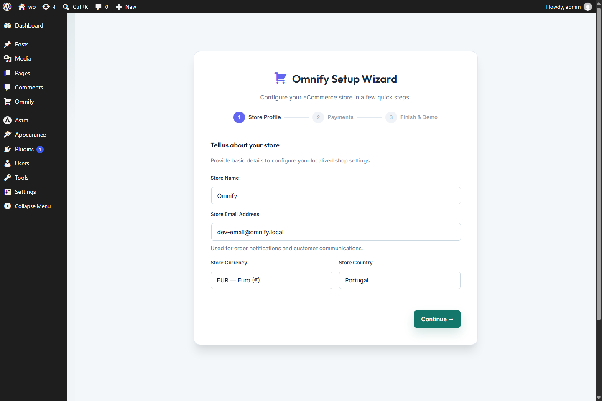
*Figure 2.1: OmnifyWP eCommerce Setup Wizard guiding store owners through essential initial configuration.*

### Core Generated Store Pages
During installation, OmnifyWP creates and configures the following dedicated storefront pages:

| Page Title | Default Slug | Shortcode | Description |
| :--- | :--- | :--- | :--- |
| **Storefront** | `/storefront/` | `[omnify_storefront]` | Main shop catalog grid featuring responsive filtering and search. |
| **Cart** | `/cart/` | `[omnify_cart]` | Interactive shopping cart with quantity selectors and coupon box. |
| **Checkout** | `/checkout/` | `[omnify_checkout]` | Frictionless conversion-optimized checkout and payment form. |
| **Customer Portal** | `/customer-portal/` | `[omnify_customer_portal]` | Customer self-service dashboard for orders, addresses, and downloads. |
| **Order Tracking** | `/order-tracking/` | `[omnify_order_tracking]` | Instant public tracking lookup via Order Number and Billing Email. |
| **Secure Download** | `/secure-download/` | `[omnify_download_page]` | Cryptographic streaming handler for authorized digital files. |

---

## 3. Store Dashboard & Performance Overview

The **Omnify Dashboard** (**Omnify → Dashboard**) serves as your central command center, offering real-time visibility into sales metrics, order volumes, inventory, and customer activity.

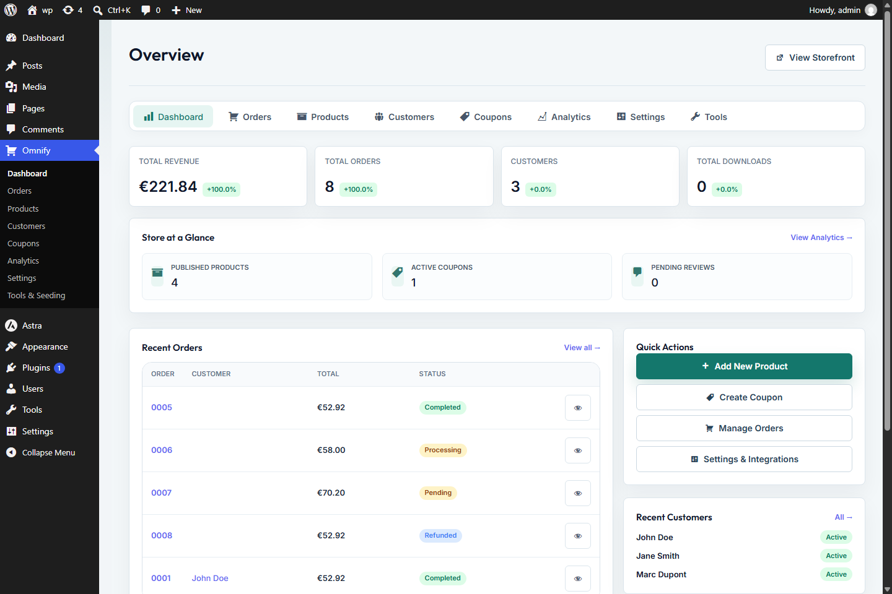
*Figure 3.1: Omnify Store Dashboard showing financial KPIs, active coupons, recent transactions, and quick action shortcuts.*

### Key Performance Indicators (KPIs)
At the top of the dashboard, four metric cards display vital statistics along with percentage comparisons against previous periods:
* **Total Revenue**: Cumulative gross revenue generated by completed and processing orders.
* **Total Orders**: Total volume of customer transactions processed.
* **Customers**: Registered customer profiles and purchasing accounts.
* **Total Downloads**: Cumulative authorized digital product deliveries.

### Store at a Glance & Quick Actions
* **Store at a Glance**: Displays published products count, active coupon campaigns, and customer reviews pending administrative moderation.
* **Quick Actions Panel**: Direct one-click shortcuts to:
  * **+ Add New Product**: Jump straight into the product creation suite.
  * **Create Coupon**: Launch a new promotional campaign.
  * **Manage Orders**: Navigate to the orders fulfillment table.
  * **Settings & Integrations**: Configure gateways, taxes, and system settings.
* **Recent Orders & Recent Customers**: Real-time tabular previews of your latest incoming customer transactions and newly registered shoppers.

---

## 4. Product Catalog & Inventory Management

### Products Directory & Filters
Navigate to **Omnify → Products** to inspect, search, and manage your entire product catalog. The listing displays the product thumbnail, SKU, regular/sale price, publication status, assigned categories, tags, physical/digital file badges, and quick management actions.

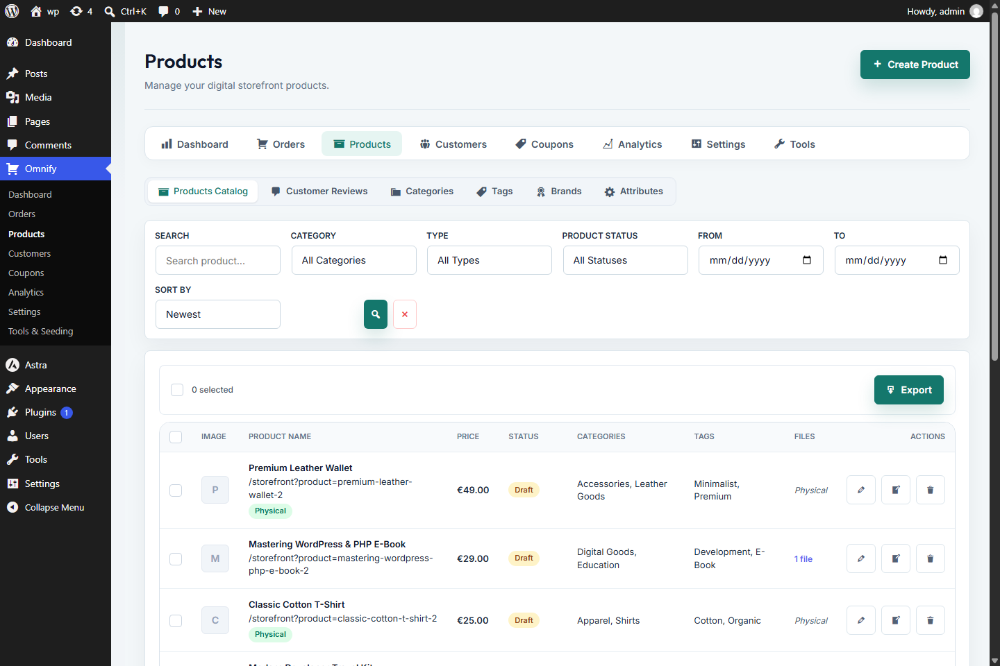
*Figure 4.1: Product catalog management table with multi-attribute filtering, date ranges, status filters, and bulk export.*

#### Filter and Search Capabilities:
* **Search Field**: Instantly search by product title, SKU, or slug.
* **Category Filter**: Filter items by specific catalog taxonomies.
* **Product Type**: Narrow down by Physical, Digital Download, Variable, or Bundle.
* **Product Status**: View All, Published, Draft, or Trashed records.
* **Date Range**: Filter products added between specific calendar dates.
* **Bulk Export**: Export your filtered catalog to CSV with a single click.

---

### Adding & Editing Products
To create a new product, click **+ Add New Product** or edit an existing product to open the product editor.

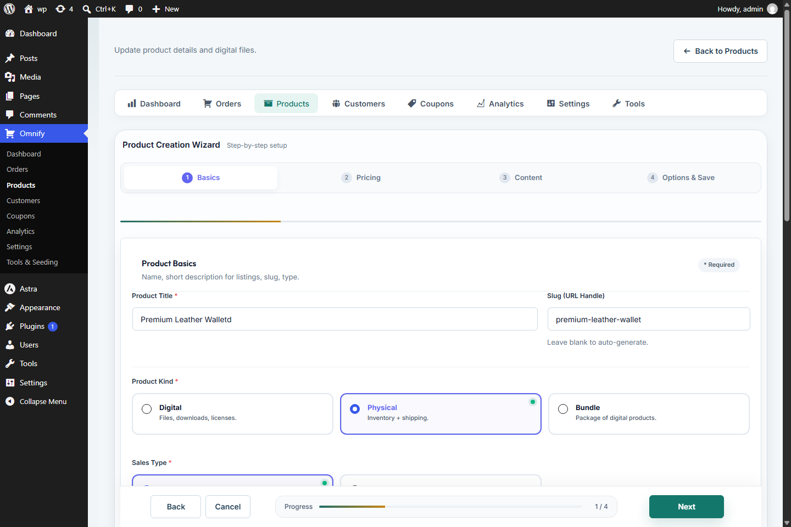
*Figure 4.2: Comprehensive product editor interface for pricing, stock management, dimensions, and digital file attachments.*

#### Essential Product Fields:
1. **Product Name & Slug**: Enter a descriptive title and customize the SEO-friendly URL slug.
2. **Product Description & Excerpt**: Full rich-text description for the product page and a concise summary for card previews.
3. **Product Type**: Choose between:
   * **Physical**: Tangible items requiring weight, dimensions, and shipping calculations.
   * **Digital / Downloadable**: Software, eBooks, presets, or media requiring secured file attachments.
   * **Variable**: Multi-variant products with options such as Size, Color, or Material.
   * **Bundle**: Curated collections of multiple items sold as a package.
4. **Pricing & Sale Rules**:
   * **Regular Price**: Standard retail price.
   * **Sale Price**: Optional promotional price with optional schedule dates.
5. **Inventory & SKU**:
   * **SKU**: Unique Stock Keeping Unit identifier.
   * **Manage Stock**: Toggle inventory tracking on/off.
   * **Stock Quantity**: Specify available warehouse units.
   * **Allow Backorders**: Permit purchases when stock reaches zero.
6. **Shipping Specifications**: Input physical package weight, length, width, and height.
7. **Digital Locker Attachments**: For digital items, upload downloadable files, set maximum download counts, and define expiration intervals.

---

### Product Taxonomies

OmnifyWP eCommerce includes structured taxonomies to organize your storefront catalog:

#### 1. Product Categories (**Omnify → Categories**)
Group items hierarchically (e.g., *Apparel → Jackets*, *Digital Goods → Templates*). Categories can have custom images, descriptions, and slugs.

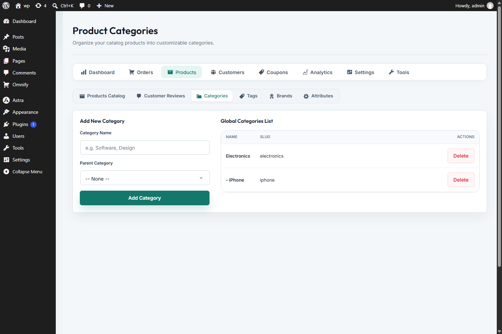
*Figure 4.3: Category management table for organizing storefront catalog taxonomy.*

#### 2. Product Tags (**Omnify → Tags**)
Attach granular keywords and thematic tags to help customers discover related items.

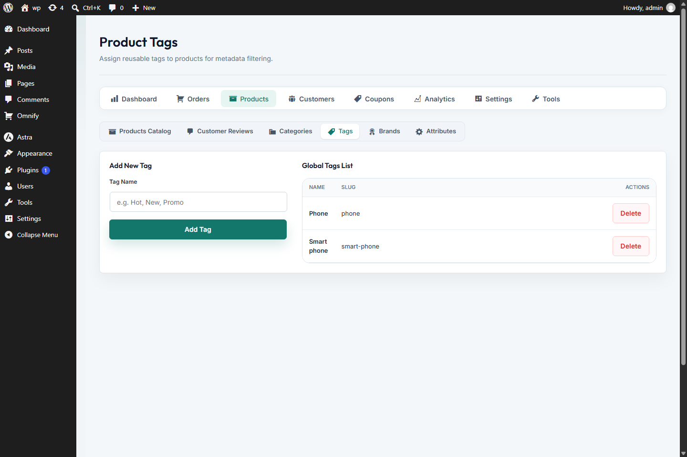
*Figure 4.4: Tag directory showing tag names, slugs, and associated product counts.*

#### 3. Product Brands (**Omnify → Brands**)
Assign manufacturer or brand identifiers to products with dedicated brand logos and storefront filtering.

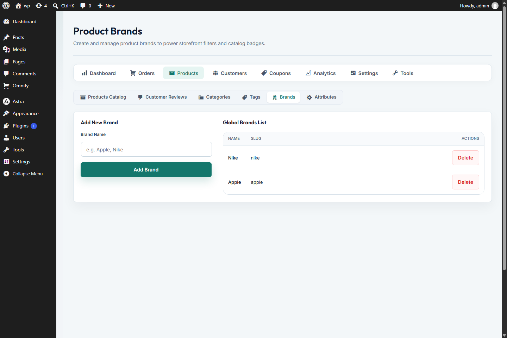
*Figure 4.5: Brands management table for catalog brand filtering.*

#### 4. Product Attributes (**Omnify → Attributes**)
Define global attributes (such as *Color*, *Size*, *Format*, or *Storage*) and assign terms (e.g., *Small, Medium, Large* or *Red, Navy, Charcoal*) used to create variable product matrix variations.

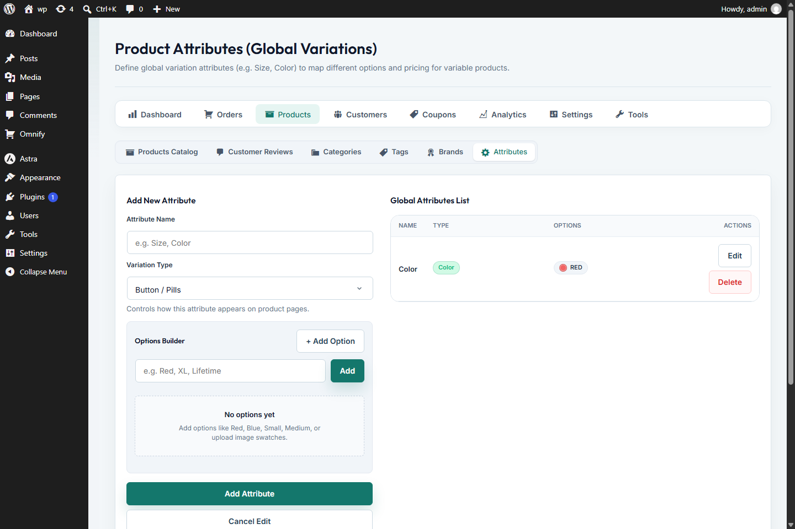
*Figure 4.6: Global Attributes manager for configuring variation axes and terms.*

---

## 5. Order Lifecycle, Fulfillment & Refunds

### Orders Listing & Status Workflows
Manage all storefront transactions under **Omnify → Orders**. Every order displays its unique sequential Order Number, Customer Name, Timestamp, Payment Method, Fulfillment Status, and Total Amount.

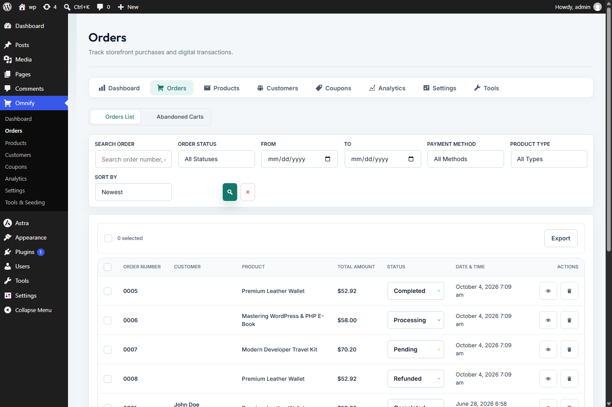
*Figure 5.1: Orders management directory with status tabs, customer details, and action shortcuts.*

#### Supported Order Statuses:
* **Pending**: Order initiated but payment confirmation has not yet been received.
* **Processing**: Payment confirmed successfully; order is awaiting fulfillment or physical dispatch.
* **Completed**: Items fulfilled and delivered; digital access granted permanently.
* **On Hold**: Awaiting manual verification (e.g., Direct Bank Transfer or Cheque payment).
* **Cancelled**: Order cancelled by customer or administrator prior to processing.
* **Refunded**: Transaction funds returned to buyer; digital file access automatically revoked.

---

### Order Details & Financial Breakdown
Click on any order or the eye icon to view the comprehensive **Order Detail** screen (`admin.php?page=omnify-orders&action=view&id=...`).

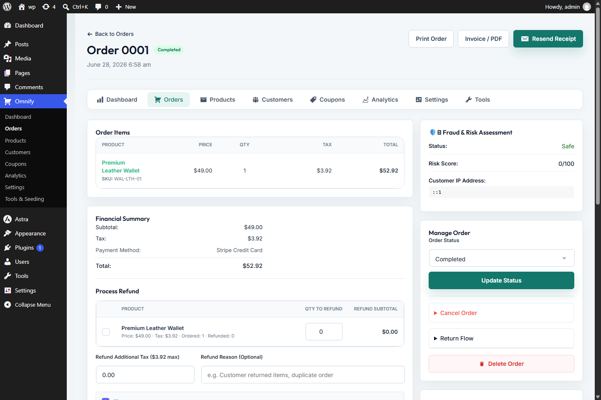
*Figure 5.2: Order detail view showing item breakdown, financial summary, fraud risk assessment, and refund tools.*

#### Key Sections of Order Detail:
1. **Order Items Table**: Line-by-line item names, variation attributes, SKUs, unit prices, purchased quantities, applied taxes, and line totals.
2. **Financial Summary**: Subtotal, shipping fees, tax calculation, discount deductions, payment gateway reference, and grand total.
3. **Fraud & Risk Assessment**: Built-in security widget evaluating transaction safety:
   * **Status**: `Safe`, `Suspicious`, or `High Risk`.
   * **Risk Score**: Score from 0 to 100 based on IP location, billing address validation, and email velocity.
   * **Customer IP Address**: Direct IPv4/IPv6 logging for dispute defense.
4. **Fulfillment Controls**: Change status dropdown, print packing slip, generate PDF invoice, or resend email receipts.
5. **Process Refund Module**:
   * Select specific items and quantities to refund.
   * Input refund amount and additional tax adjustments.
   * State optional refund rationale.
   * Omnify automatically updates inventory counts and revokes associated digital download licenses immediately upon refund completion.

---

## 6. Customer Relationship Management (CRM)

### Customer Directory & Lifetime Analytics
Under **Omnify → Customers**, store owners have a built-in CRM directory profiling every registered and guest shopper.

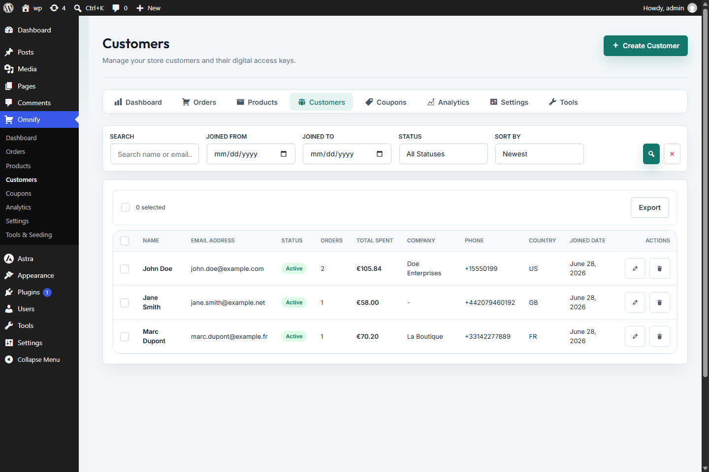
*Figure 6.1: Customer relationship management directory displaying buyer history, order volume, and lifetime spend.*

#### Customer Profile Attributes:
* **Customer Name & Email**: Primary billing and communication contacts.
* **Orders Count**: Total lifetime orders placed.
* **Lifetime Value (LTV)**: Total revenue generated by the customer.
* **Country & Location**: Primary registered geographic territory.
* **Account Status**: `Active`, `VIP`, or `Restricted`.
* **Address Book**: Primary Billing and Shipping addresses saved for seamless one-click storefront checkouts.

---

## 7. Promotions, Discounts & Coupons Engine

Promotions drive sales velocity. Under **Omnify → Coupons**, you can create and manage discount codes with comprehensive usage restrictions.

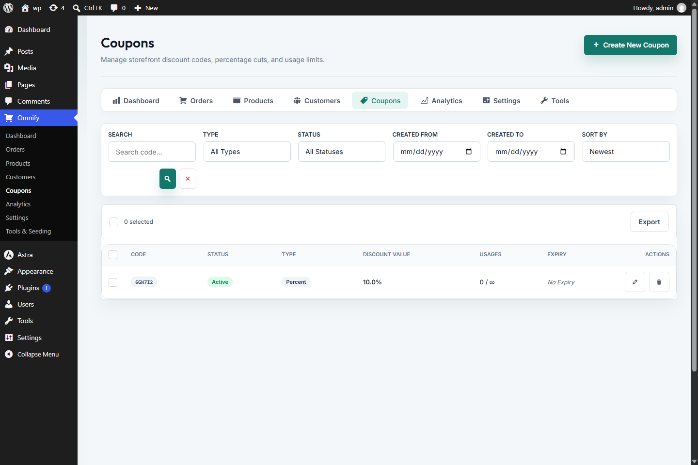
*Figure 7.1: Promotional coupon campaigns manager with usage counters, expiration dates, and discount rules.*

### Creating Promotional Coupons
Click **+ Create Coupon** to configure your promotional campaign:

| Setting Field | Options / Format | Description |
| :--- | :--- | :--- |
| **Coupon Code** | Alphanumeric (e.g., `SUMMER20`) | The code customers enter during checkout. |
| **Discount Type** | `Percentage (%)`, `Fixed Cart ($)`, `Fixed Product ($)` | Determines how the deduction is computed. |
| **Coupon Amount** | Numerical value | Percentage off or fixed monetary amount. |
| **Minimum Spend** | Monetary threshold | Minimum cart subtotal required to activate code. |
| **Maximum Spend** | Monetary cap | Maximum allowed cart value for coupon eligibility. |
| **Individual Use Only** | Yes / No | Prevents stacking with other promotional coupons. |
| **Usage Limit per Coupon** | Integer | Total times the coupon may be redeemed storewide. |
| **Usage Limit per User** | Integer | Total times an individual customer email may redeem the code. |
| **Expiry Date** | Date picker | Automatic expiration date and time. |

---

## 8. Store Analytics & Business Intelligence

Under **Omnify → Analytics**, store owners can monitor store performance with comprehensive visual reporting and financial metrics.

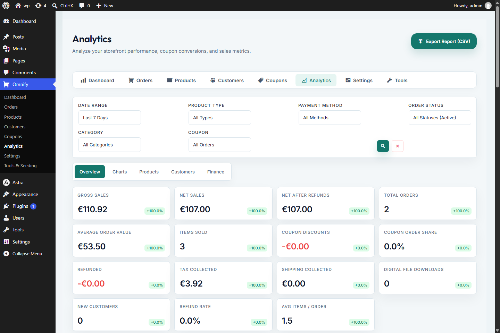
*Figure 8.1: Real-time analytics dashboard presenting sales figures, conversion metrics, AOV, and performance cards.*

### Performance Metric Cards
* **Gross Sales**: Total revenue before refunds and fees.
* **Net Sales**: Gross sales minus discounts and refunds.
* **Average Order Value (AOV)**: Mean revenue generated per transaction.
* **Items Sold**: Total units of physical and digital products purchased.
* **Coupon Discounts**: Total monetary value redeemed through promotions.
* **Tax & Shipping Collected**: Breakdown of collected governmental taxes and delivery fees.
* **Digital File Downloads**: Number of successful cryptographic download accesses.
* **CSV Export**: Click **Export Report (CSV)** to download complete transaction and accounting spreadsheets for external bookkeeping.

---

## 9. Customer Reviews Moderation

Customer feedback builds trust. Under **Omnify → Reviews**, manage all submitted product testimonials, ratings, and customer commentary.

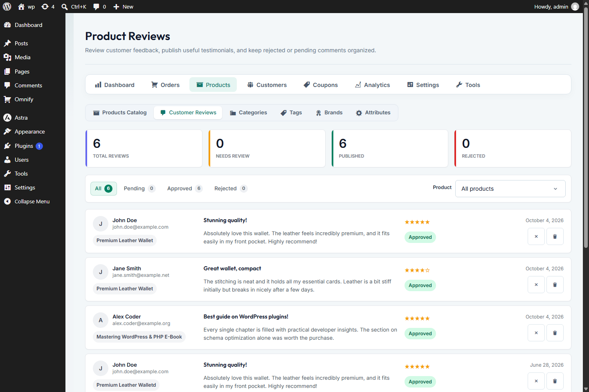
*Figure 10.1: Customer reviews moderation table with star ratings, verified buyer indicators, and status controls.*

### Review Features:
* **Verified Buyer Badge**: Automatically flags reviews left by customers who purchased the product through OmnifyWP.
* **Star Ratings**: Visual 1 to 5 star ratings.
* **Approval Workflow**: Reviews can be marked as `Approved`, `Unapproved` (held for moderation), or sent to `Trash`.
* **Direct Moderation**: Edit customer comments or reply directly to queries from the admin panel.

---

## 10. Abandoned Cart Recovery

Shopping cart abandonment is one of the biggest revenue leaks in online commerce. Under **Omnify → Abandoned Carts**, OmnifyWP automatically tracks unfinished checkouts and recovers lost sales.

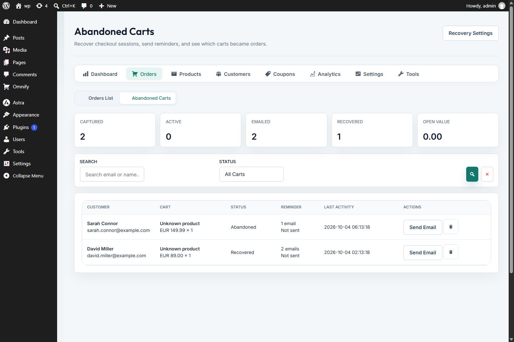
*Figure 10.1: Abandoned cart recovery directory tracking shopper email, cart contents, subtotal, and recovery status.*

### How Abandoned Cart Tracking Works:
1. **Dynamic Capture**: When a customer enters their contact email on the checkout page, Omnify securely captures the session cart contents and contact information.
2. **Abandonment Threshold**: If the checkout is not completed within 60 minutes, the session is marked as `Abandoned`.
3. **Automated Recovery**: Omnify can dispatch scheduled recovery reminder emails containing direct one-click checkout restoration links.
4. **Recovery Attribution**: When a customer returns via the link and completes payment, the status automatically switches to `Recovered`, crediting the recovery to your store reports.

---

## 11. Store Configuration & Settings

Navigate to **Omnify → Settings** to configure your store's operating rules, payment processors, tax calculations, and communication templates.

### General Settings
Configure core regional, financial, and product display parameters (**Settings → General**).

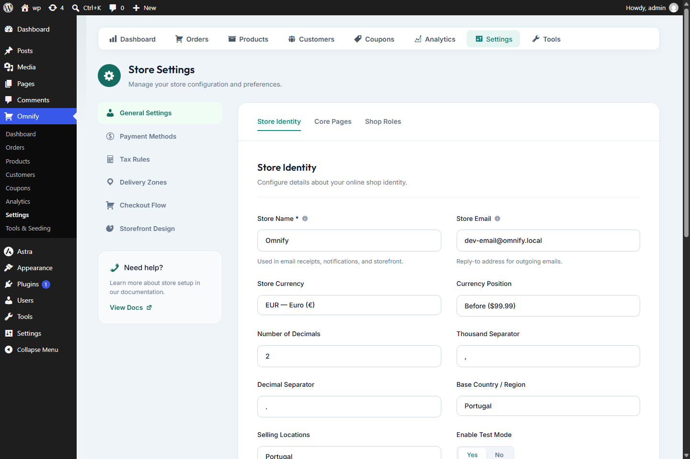
*Figure 11.1: General settings tab for store currency, formatting, and measurement units.*

* **Store Currency**: Choose from over 30 global currencies (USD, EUR, GBP, CAD, AUD, JPY, INR, BDT, etc.).
* **Currency Symbol Position**: Display symbol before (`$100`) or after (`100 €`) the numerical amount.
* **Thousand & Decimal Separators**: Set custom formatting (e.g., `,` vs `.`).
* **Decimals**: Choose decimal precision (typically `2` decimal places).
* **Weight & Dimension Units**: Specify kilograms (`kg`), pounds (`lbs`), centimeters (`cm`), or inches (`in`).

---

### Payment Gateways Configuration
Under **Settings → Payments**, activate and configure your preferred payment processing partners.

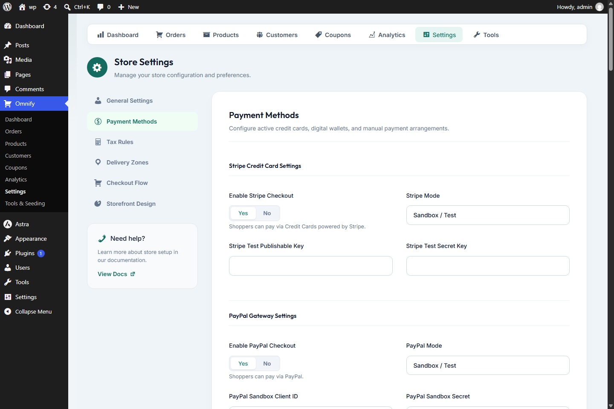
*Figure 11.2: Payment gateways settings screen supporting Stripe, PayPal, Razorpay, SSLCommerz, and manual payment options.*

#### Supported Payment Processors:
1. **Stripe**:
   * Accepts Visa, Mastercard, American Express, Apple Pay, Google Pay, and SEPA.
   * Requires: **Stripe Publishable Key**, **Stripe Secret Key**, and **Webhook Secret**.
   * Webhook endpoint: `https://yourdomain.com/wp-json/omnify/v1/webhook/stripe`.
2. **PayPal Commerce**:
   * Accepts PayPal balance, Pay in 4, and credit cards via Smart Buttons.
   * Requires: **PayPal Client ID** and **PayPal Secret**.
3. **Razorpay**:
   * Premier payment solution for India supporting UPI, QR, RuPay, NetBanking, and Wallets.
   * Requires: **Key ID** and **Key Secret**.
4. **SSLCommerz**:
   * Trusted payment gateway for Bangladesh supporting bKash, Nagad, Rocket, and local debit cards.
   * Requires: **Store ID** and **Store Password**.
5. **Manual Payment Gateways**:
   * **Cash on Delivery (COD)**: Allow buyers to pay upon physical delivery.
   * **Direct Bank Transfer (BACS)**: Display bank account numbers, IBAN, and BIC for wire transfers.
   * **Cheque Payment**: Instructions for sending paper cheques.

---

### Shipping & Delivery Zones
Under **Settings → Delivery**, set up your shipping fulfillment rules and delivery rates.

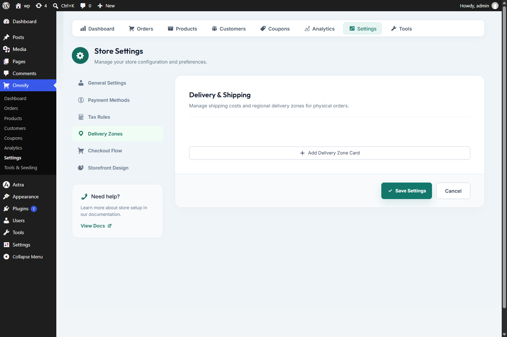
*Figure 11.3: Delivery settings for configuring shipping methods, flat rates, and free shipping thresholds.*

* **Flat Rate Shipping**: Charge a standard fee per order or per item.
* **Free Shipping Threshold**: Automatically grant free shipping when cart subtotal exceeds a designated amount (e.g., Free shipping over $75).
* **Local Pickup**: Allow local customers to collect their orders in-store without shipping fees.

---

### Tax Calculation & Regional Rates
Under **Settings → Tax**, configure sales tax, VAT, or GST calculations.

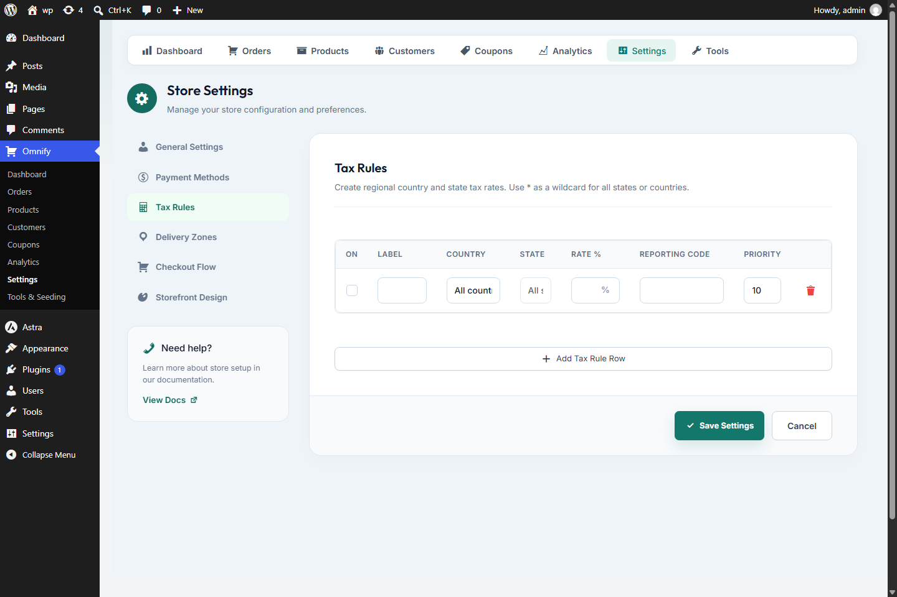
*Figure 11.4: Tax settings for inclusive/exclusive pricing, compound rates, and regional tax tables.*

* **Tax Calculation Status**: Enable or disable automated tax calculations.
* **Prices Entered With Tax**: Choose whether your catalog prices are tax-inclusive or tax-exclusive.
* **Calculate Tax Based On**: Calculate tax from Customer Shipping Address, Customer Billing Address, or Store Base Address.
* **Tax Classes**: Set Standard, Reduced Rate, or Zero Rate rules.

---

### Customer Email Notifications & Templates
Under **Settings → Email**, manage customer notifications and administrative alerts.

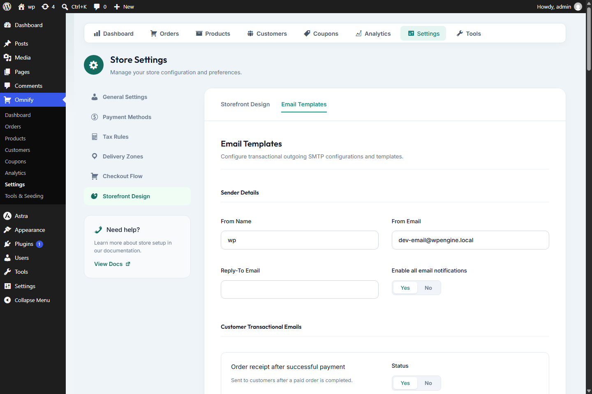
*Figure 11.5: Automated email management panel for customer receipts, order updates, and admin alerts.*

#### Automated Store Emails:
* **Customer Order Confirmation**: Dispatched immediately upon successful checkout with order receipt and download links.
* **Order Processing & Dispatched**: Sent when an order is updated with tracking details.
* **Order Refunded Notice**: Dispatched when an order is refunded.
* **New Order Alert (Admin)**: Sends an instant summary to store managers when a new sale is made.
* **Abandoned Cart Reminder**: Dispatched to re-engage customers who abandoned their carts.

---

### Checkout Flow Configuration
Under **Settings → Checkout**, configure your storefront conversion settings.

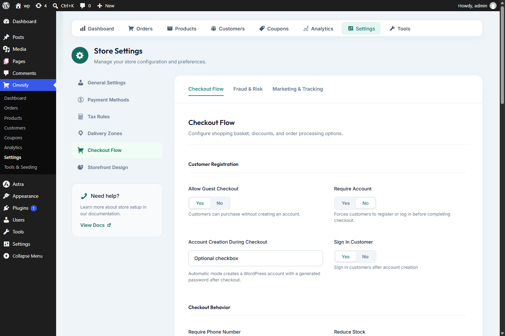
*Figure 11.6: Checkout flow configuration for guest checkout, terms requirements, and address forms.*

* **Guest Checkout**: Permit customers to place orders without creating a WordPress account.
* **Account Creation**: Option to automatically create customer accounts during checkout.
* **Coupon Input**: Toggle whether coupon code redemption boxes appear on cart and checkout pages.
* **Terms & Conditions**: Require shoppers to accept your store terms before completing checkout.

---

### Store Pages Mapping
Under **Settings → Pages**, review or remap the core store pages associated with Omnify shortcodes.

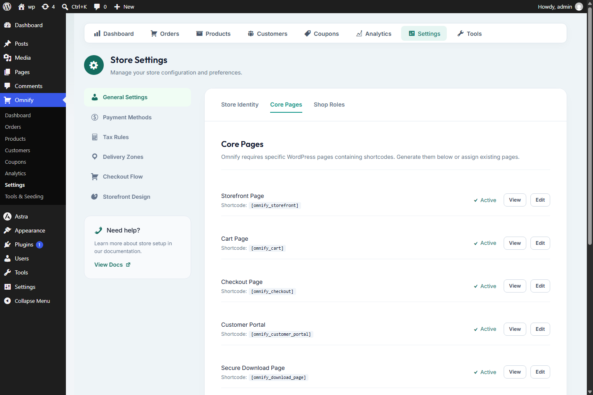
*Figure 11.7: Core storefront page mapping and shortcode assignment screen.*

---

## 12. System Tools, Demo Seeding & Maintenance

Under **Omnify → Tools & Seeding**, store administrators can maintain database health, flush caches, or seed demo data for store previewing.

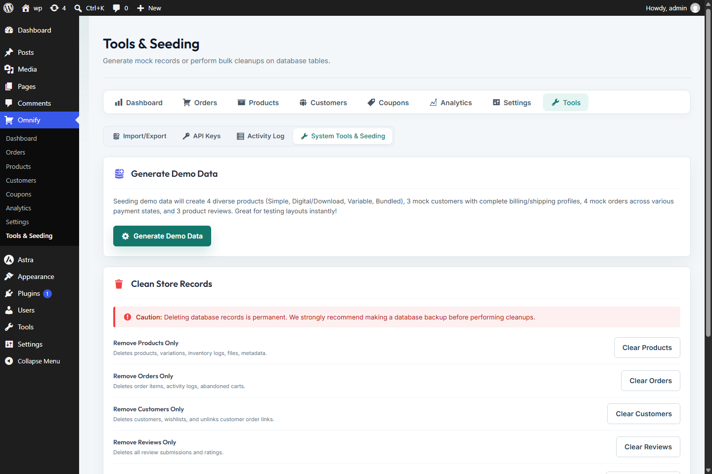
*Figure 12.1: System diagnostics, one-click demo data generation, and database optimization tools.*

### Available Tools:
* **Generate Demo Data**: Instantly populates your store with realistic sample products, customers, orders, reviews, and categories for theme development and testing.
* **Clear Demo Data**: Completely wipes all generated demo records while preserving real store transactions.
* **Flush Transients & Caches**: Clears cached catalog queries, transients, and calculated price indices.
* **Verify Database Tables**: Checks and repairs the 18 custom Omnify database tables to ensure structural integrity.

---

## 13. Administrative Activity Audit Log

Under **Omnify → Activity Log**, the plugin maintains an immutable audit trail of all administrative actions.

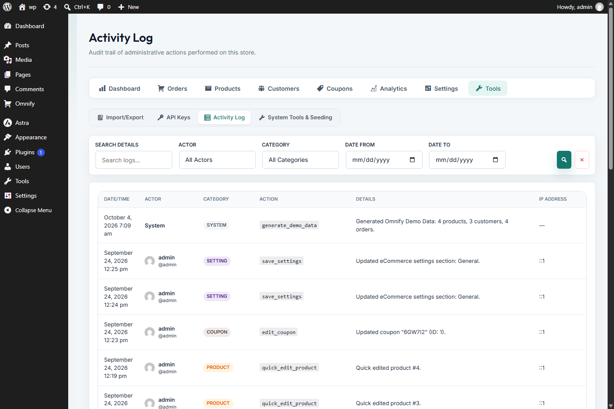
*Figure 13.1: Administrative audit trail recording staff actions, status updates, and setting changes.*

### Logged Events Include:
* Product creation, price modifications, and inventory adjustments.
* Order status updates and refund processing.
* Coupon creations, modifications, and deletions.
* Store setting alterations and gateway credential updates.
* Recorded metadata includes staff username, timestamp, and IP address.

---

## 14. REST API Access & Integrations

Under **Omnify → API Keys**, generate secure REST API credentials for mobile applications, third-party ERPs, CRM systems, and headless frontends.

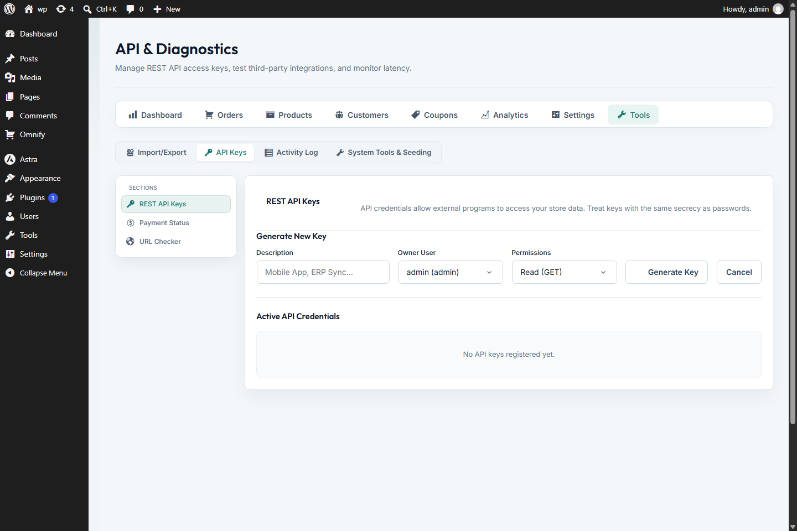
*Figure 14.1: REST API key management panel for headless commerce and external integrations.*

### Generating API Credentials:
1. Click **+ Add Key**.
2. Provide a **Description** (e.g., *iOS Mobile App* or *Zapier Fulfillment Sync*).
3. Select **Permissions**: `Read`, `Write`, or `Read/Write`.
4. Click **Generate API Key** to receive your **Consumer Key** and **Consumer Secret**.
5. All REST endpoints are available under the `/wp-json/omnify/v1/` route.

---

## 15. Customer Storefront Experience

### Storefront Catalog & Grid Filters
The storefront catalog page (`[omnify_storefront]`) displays your active products in a responsive grid with sidebar filtering.

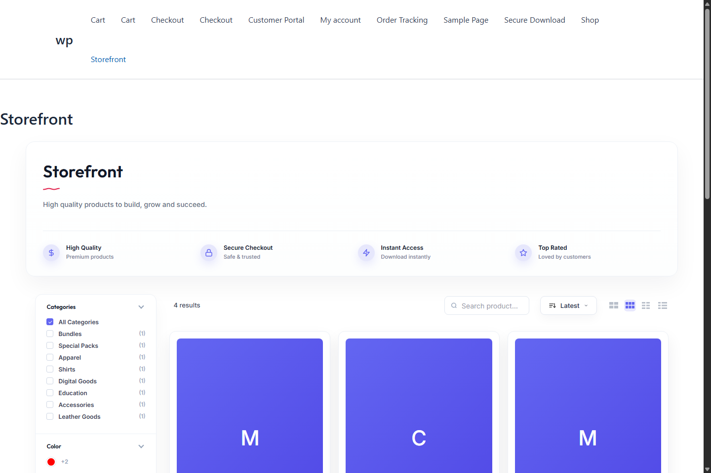
*Figure 15.1: Customer storefront catalog featuring search, category filters, responsive product cards, and instant add-to-cart.*

* **Interactive Filters**: Filter by Category, Brand, Price Range, and In-Stock availability.
* **Quick Add-to-Cart**: Hovering over product cards reveals an instant AJAX Add-to-Cart button.
* **Sort Options**: Sort by Newest, Price: Low to High, Price: High to Low, or Customer Rating.

---

### Single Product Page
Clicking any product opens the product details layout designed for high conversions.

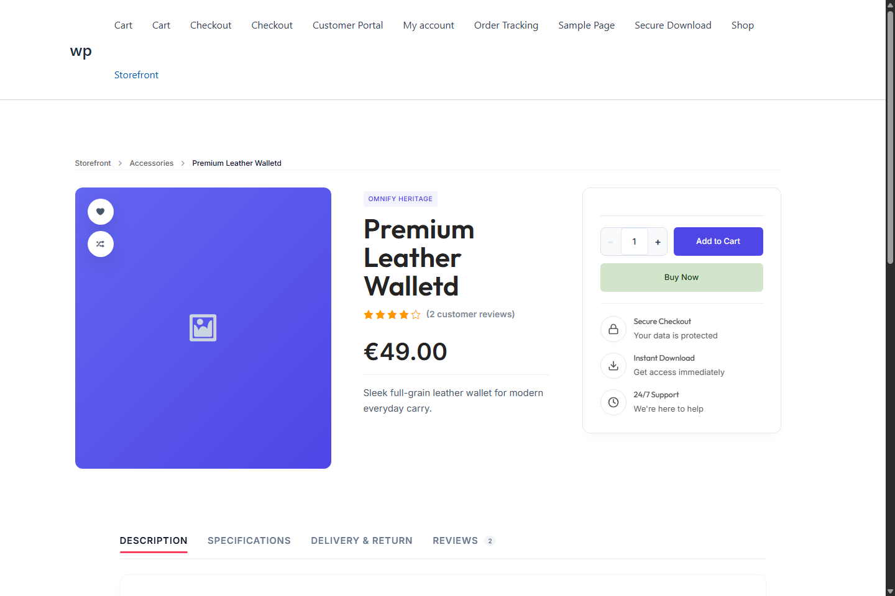
*Figure 15.2: Product details page with image gallery, trust badges, format selection, and customer reviews.*

* **Product Gallery**: High-resolution image zoom and gallery carousel.
* **Trust Badges & Security Seals**: Built-in badges highlighting encrypted checkout and money-back guarantees.
* **Variation Swatches**: Select options via buttons, color chips, or dropdown selectors.
* **Customer Reviews & Ratings**: Displays real buyer reviews and verified buyer badges.

---

### Interactive Shopping Cart
The shopping cart page (`[omnify_cart]`) provides an intuitive overview of selected items.

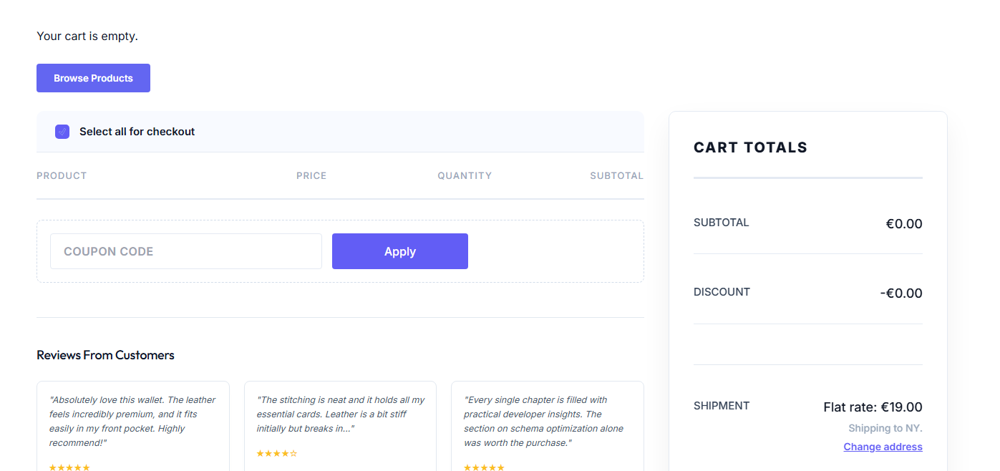
*Figure 15.3: Shopping cart page showing line item quantities, coupon redemption, shipping preview, and cart totals.*

* **Quantity Controls**: Adjust quantities or remove items with automatic AJAX total updates.
* **Coupon Application**: Enter promotional codes and receive instant feedback.
* **Shipping Estimate**: Real-time delivery fee calculation based on destination.

---

### Frictionless Multi-Step Checkout
The checkout page (`[omnify_checkout]`) streamlines the payment journey into clear, confidence-inspiring steps.

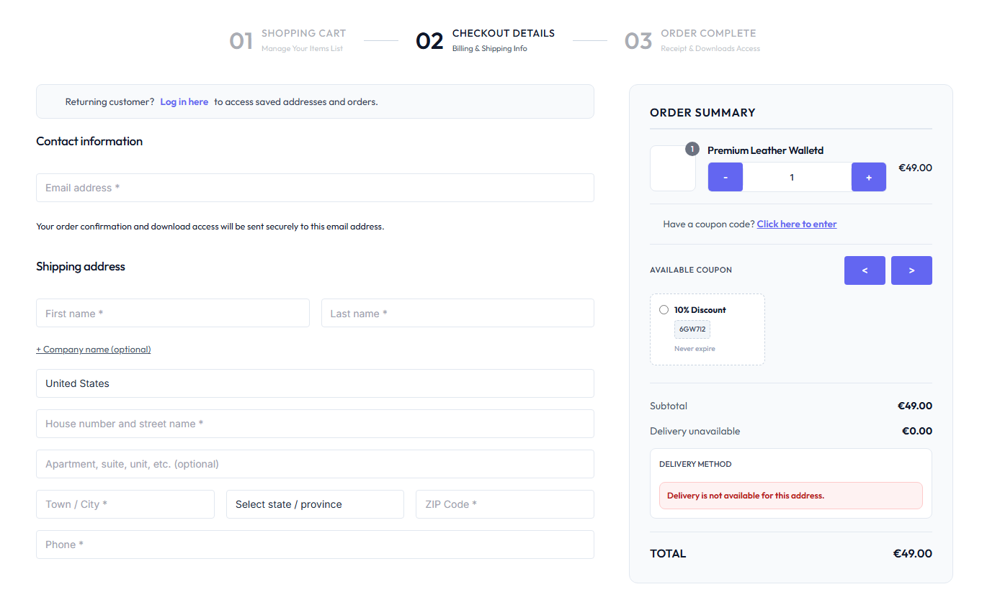
*Figure 15.4: Modern multi-step checkout interface with live order summary, available coupons, and payment options.*

* **Step Indicator**: Clear visual progression: `01 Shopping Cart` → `02 Checkout Details` → `03 Order Complete`.
* **Smart Autofill**: Returning customers can log in to autofill saved billing and shipping details.
* **Available Coupons Tray**: Displays active store promotions directly on the checkout page for easy redemption.
* **Integrated Payment Forms**: Credit card inputs via Stripe Elements, PayPal buttons, and manual payment options.

---

### Customer Account Portal & Order Tracking
Customers can manage their relationship with your store using dedicated self-service pages:

#### Customer Portal (`[omnify_customer_portal]`)
Allows logged-in buyers to view past order history, download digital purchases, and manage saved billing/shipping addresses.

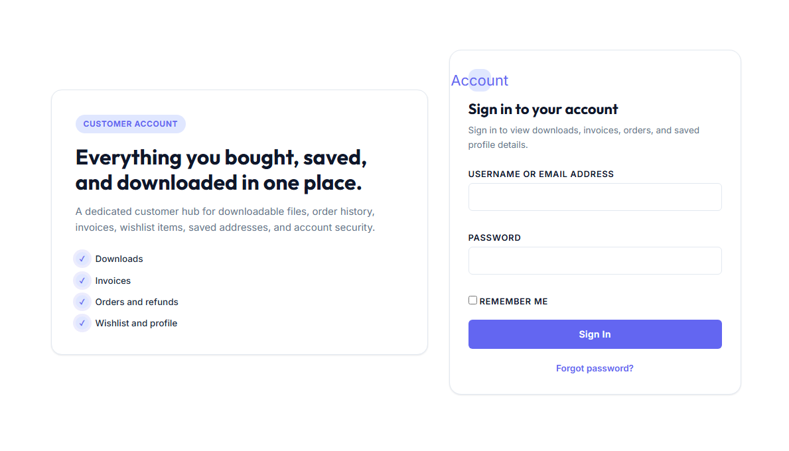
*Figure 15.5: Customer self-service dashboard for order history, address books, and profile settings.*

#### Order Tracking Portal (`[omnify_order_tracking]`)
Allows guest shoppers to check order progress without logging into an account.

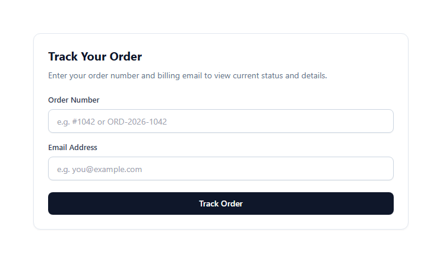
*Figure 15.6: Order tracking lookup tool requiring only Order Number and Billing Email.*

---

### Cryptographic Digital Downloads Delivery
OmnifyWP features an enterprise digital locker for software, media, and downloadable files:
* **HMAC-SHA256 Tokenization**: Download links use cryptographic tokens salted with WordPress authentication keys.
* **Direct Path Masking**: Actual server file paths (`wp-content/uploads/...`) are never exposed to the client.
* **Chunked Streaming**: Files stream in 8KB memory-safe chunks, enabling downloads of large files without hitting PHP memory limits.
* **Automatic Expiration & Limits**: Access links expire after a designated time window (e.g., 7 days) or download count (e.g., 3 attempts).
* **Automatic Revocation**: If an order is refunded, all active download access tokens are immediately revoked.

---

## 16. Frequently Asked Questions & Troubleshooting

### Q: Why is OmnifyWP faster than standard WooCommerce?
> **A:** OmnifyWP stores products, orders, and customer data in dedicated, normalized SQL tables (`wp_omnify_*`) rather than cramming metadata into WordPress's shared `wp_posts` and `wp_postmeta` tables. This enables single-query lookups with proper database indexing, eliminating costly postmeta joins.

### Q: How do I test payments before going live?
> **A:** Navigate to **Omnify → Settings → Payments**. Enable **Test Mode** (Sandbox) for Stripe or PayPal, enter your test API keys, and test transactions using Stripe/PayPal test cards without processing real charges.

### Q: Where are digital files stored on the server?
> **A:** Digital files are uploaded to WordPress's secure upload directory (`wp-content/uploads/omnify_files/` or protected storage). Direct file access via URL is blocked by server configuration; downloads are served exclusively through Omnify's streaming handler.

### Q: What should I do if an order does not automatically update after payment?
> **A:** Verify your payment gateway webhooks. For Stripe, confirm that the webhook endpoint `https://yourdomain.com/wp-json/omnify/v1/webhook/stripe` is configured in your Stripe Dashboard with the correct **Webhook Signing Secret** entered in **Omnify → Settings → Payments**.

### Q: Can I run Omnify alongside other plugins?
> **A:** Yes. OmnifyWP runs smoothly alongside popular page builders (Elementor, Beaver Builder, Block Editor), SEO plugins, and caching suites without conflict.

---

*Documentation maintained by the OmnifyWP Development Team. For support and developer inquiries, visit [https://omnifywp.com/doc/](https://omnifywp.com/doc/).*
